# PdSynth
### Simple monophonic substractive synthesizer using Pure Data.
The Pd patch is a monophonic subtractive synthesizer with three oscillators of selectable waveforms and wave folder, a mixer, a resonant low pass filter and two envelope generators (one for the LPF and another for the VCA).

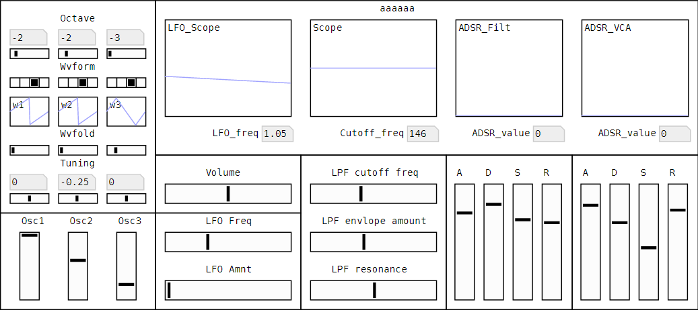

The whole structure of the synthesizer is showed in the next screenshot:

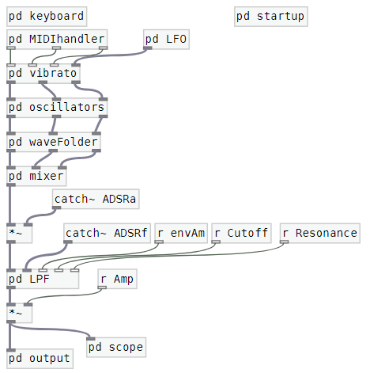

For clarity and tidiness, I split everything into different sub-patches so the signal flow can be followed at a glance. Next, I'll follow the signal path through all the sub-patches.

1. When a key is pressed, a MIDI note number is sent, this number is then corrected to match the octave and tuning configuration for each of the oscillators for each of the values in the MIDI handler sub-patch. The sends `octX` and `tuneX` come from the value of the octave and tuning sliders in the GUI.

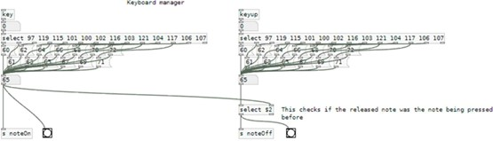

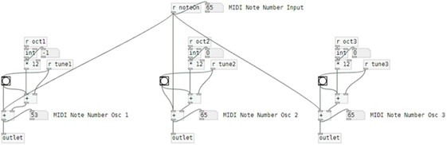

2. A vibrato is then applied by adding to the MIDI note number a low frequency oscillator (LFO) times the slider amount slider value (LFOAm) as the modulator for each of the oscillators. The LFO input is then multiply by 12 in the vibrato sub-patch to make the max amplitude of the vibrato a full octave. Finally, the adapted and modulated MIDI note number values are converted to Hertz.

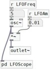

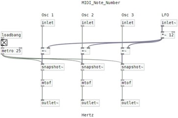

3. The frequency values (in Hz) for each of the oscillators is then introduced to the oscillators sub-patch. Three waveforms (sine, square and sawtooth) and white noise are available to choose for each of the oscillators.
    a. For the sine wave the `osc~` object was used.
    b. The square wave was achieved by clipping the sinewave multiplied by a big scalar (10000 in this case).
    c. For the sawtooth wave the `phasor~` object was used. Its output was corrected by subtracting the offset and normalizing its amplitude between -1 and 1.
All the waveforms are introduced into the `multiplex~` object that allows the user to choose between the four waveforms using the GUI. The selection marked on the GUI is received as `wF1` in the sub-patch.

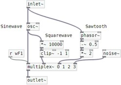

4.	To make the waveforms a bit more interesting I added a wave folder to the synth. If the instantaneous value of the wave is above 1 or below -1 is "folded". The wFoldGainX variable is sent from the wave fold slider on the GUI and is used to multiply the input signal coming from each of the oscillators. The wave folding is not useful for the square wave and the white noise option but produce interesting results on the sinusoid and the sawtooth waves. By folding the sawtooth with a gain value of 2 a triangular wave can be produced too.

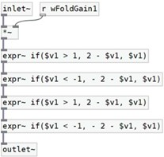

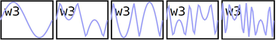

5.	The signal of the output of the three wave folders is then added on the mixer sub-patch. To set the volume of each channel the input signal is multiplied by the value of that channel slider (vX). the output of the mixer is then normalized by dividing by the number of channels so that the output is always in the -1 to 1 range.

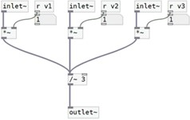

6.	To control the envelope of the volume of the note an envelope generator (or ADSR) is used. The envelope generator receives a noteOn signal when one of the keys on the keyboard assigned to a note is pressed and draws the attack, decay and sustain part of the envelope. When a noteOff signal is received (one of the assigned keys has been released) the release part of the envelope is drawn. The envelope is then sent to the filter or the amplifier, to the graph and to the number box in the GUI that shows the momentary value of the envelope.

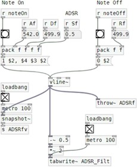

7.	Lastly the signal from the mixer is filtered using a low pass filter (LPF). The cutoff frequency and the resonance of the filter can be set up using the GUI sliders. The cutoff value is then added to the ADSR scaled and multiplied by the envelope amount value coming from the last GUI slider. The cutoff value is sent to the GUI and the output of the filter (bob~ object) is sent to the output of the sub-patch.

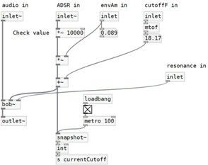

8.	The output of the filter goes to the output sub-patch that just clips the output to avoid any issues and sends the audio to the dac~ object.

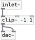